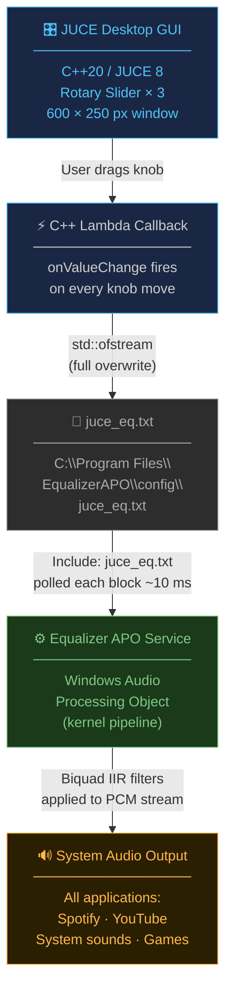

# System-Wide Windows Audio Equalizer

> A real-time, system-wide audio equalizer for Windows, engineered with a **Hybrid IPC Architecture** that couples a high-performance C++/JUCE GUI frontend to the Windows kernel-level audio pipeline through Equalizer APO — without writing a single line of kernel driver code or requiring driver signing.

---

## Why This Architecture

Building a true system-wide equalizer on Windows requires either:

| Approach | Challenge |
|---|---|
| Custom Windows APO (Audio Processing Object) | Requires kernel driver signing (~$500/year EV certificate), C++ COM object registration, and direct WASAPI/KS integration |
| Virtual audio cable + DSP app | Adds latency; creates extra device entries; conflicts with exclusive-mode apps |
| **Hybrid IPC (this project)** | Delegates kernel work to Equalizer APO; GUI only writes a text file |

This project uses the third approach: Equalizer APO handles all kernel-level Biquad coefficient computation and real-time audio injection. The JUCE application is a pure GUI controller that communicates via shared file I/O — the simplest and most robust IPC mechanism available on Windows.

---

## Architecture Diagram



**Data flow summary:**

```
[JUCE Rotary Slider]
        │  onValueChange lambda (C++20)
        ▼
[writeEqualizerConfig()]
        │  std::ofstream — full overwrite, RAII close
        ▼
[C:\Program Files\EqualizerAPO\config\juce_eq.txt]
        │  Equalizer APO "Include:" directive — polled every audio block
        ▼
[Equalizer APO Windows Audio Processing Object]
        │  Second-order IIR Biquad filters applied in-kernel
        ▼
[Speakers / Headphones — all applications affected]
```

---

## Technical Highlights

### Inter-Process Communication via Real-Time File I/O

The GUI and the audio pipeline run in separate OS-level processes and communicate exclusively through a shared text file.  Every slider movement triggers a full rewrite of `juce_eq.txt` using `std::ofstream` in truncate mode.  Equalizer APO's internal file-watcher detects the change within one audio buffer (~10 ms at 48 kHz / 512 samples) and recomputes its DSP coefficients — achieving near-zero perceived latency for the user.

```cpp
// Truncate mode = atomic full overwrite, no partial-read race condition
std::ofstream cfg(kEqualizerApoConfigPath, std::ios::out | std::ios::trunc);

cfg << "Filter 1: ON LSC Fc 200 Hz Gain "
    << fmtGain(bassSlider.getValue()) << " dB Q 0.707\n";
// cfg destructor: RAII flush + OS file-handle release
```

### C++20 Lambda Callbacks

Slider state changes are wired to the file writer through `std::function`-backed lambdas captured with `[this]`:

```cpp
bassSlider.onValueChange = [this]() { writeEqualizerConfig(); };
```

No virtual dispatch, no manual observer registration — the lambda is stored directly on the `juce::Slider` object and invoked on the JUCE message thread.

### DSP Filter Chain (Equalizer APO Biquad Syntax)

The file written to disk encodes three second-order IIR sections:

| Band   | Filter Type          | Centre / Corner | Q     | Purpose |
|--------|----------------------|-----------------|-------|---------|
| Bass   | Low Shelf (LSC)      | 200 Hz          | 0.707 | Butterworth shelf — maximally flat passband |
| Mid    | Peaking EQ (PK)      | 1 kHz           | 1.0   | ~1-octave bell curve (500 Hz – 2 kHz) |
| Treble | High Shelf (HSC)     | 4 kHz           | 0.707 | Butterworth shelf — symmetric to Bass |

Equalizer APO translates these parameters to Direct-Form II Biquad coefficients (`b0, b1, b2, a1, a2`) in real-time using the Audio EQ Cookbook formulas (R. Bristow-Johnson).

### JUCE 8 Framework

- **`juce::Component`** with a fixed 600 × 250 layout — no audio I/O modules loaded
- **`juce::Slider::RotaryVerticalDrag`** — standard DAW-style rotary knobs
- **`juce::FontOptions`** API — JUCE 8's deprecation-free font builder
- **`juce::DocumentWindow`** — native OS title bar and close button integration

---

## Prerequisites

| Requirement | Version | Notes |
|---|---|---|
| Windows | 10 / 11 | x64 required |
| [Equalizer APO](https://equalizerapo.sourceforge.net/) | 1.3+ | Must be installed before running setup script |
| [JUCE SDK](https://juce.com/get-juce/) | 8.x | Local path configured in `CMakeLists.txt` |
| CMake | 3.22+ | |
| Visual Studio 2022 | 17.x | Community edition is free |
| Git | any | For JUCE FetchContent fallback |

---

## Build Instructions

### 1. Install Equalizer APO

Download from [equalizerapo.sourceforge.net](https://equalizerapo.sourceforge.net/).  
During setup, **select your primary output device** (headphones or speakers).

### 2. Configure CMake

```powershell
# Clone / navigate to the project root
cd "Audio Equalizer\Core DSP Engine\LiveEqualizer"

# Configure (Visual Studio 2022 generator)
cmake -B build -G "Visual Studio 17 2022" -A x64

# If your JUCE is at a different path, override the cache variable:
cmake -B build -G "Visual Studio 17 2022" -A x64 `
      -DJUCE_PATH="C:/path/to/your/JUCE"
```

### 3. Build Release

```powershell
cmake --build build --config Release
```

The executable is written to:
```
build\LiveEqualizer_artefacts\Release\System Audio Equalizer.exe
```

### 4. Run the APO Setup Script (one-time, run as Administrator)

```powershell
# From the Core DSP Engine directory
Set-ExecutionPolicy -Scope Process -ExecutionPolicy Bypass
.\setup_link.ps1
```

This appends `Include: juce_eq.txt` to Equalizer APO's `config.txt`.

### 5. Create a Desktop Shortcut (optional)

```powershell
$WshShell = New-Object -ComObject WScript.Shell
$Shortcut = $WshShell.CreateShortcut("$env:USERPROFILE\Desktop\Audio Equalizer.lnk")
$Shortcut.TargetPath = "$PWD\LiveEqualizer\build\LiveEqualizer_artefacts\Release\System Audio Equalizer.exe"
$Shortcut.Save()
```

---

## Usage

1. Launch **System Audio Equalizer.exe** (or the desktop shortcut).
2. Drag any knob — changes are applied system-wide within ~10 ms.
3. The equalizer affects **all** Windows audio simultaneously (Spotify, browsers, games, system sounds).
4. Double-click any knob to reset that band to 0 dB.
5. Close the window at any time — Equalizer APO retains the last written settings until the app is relaunched.

---

## Project Structure

```
Audio Equalizer\Core DSP Engine\
│
├── LiveEqualizer\                    # JUCE application
│   ├── Source\
│   │   ├── Main.cpp                  # JUCEApplication entry point + MainWindow
│   │   ├── MainComponent.h           # GUI component declaration + IPC constants
│   │   └── MainComponent.cpp         # Slider setup, paint, resized, file writer
│   └── CMakeLists.txt                # Build configuration (JUCE 8, C++20)
│
├── setup_link.ps1                    # One-time Equalizer APO wiring script
└── README.md                         # This file
```

---

## How the IPC Bridge Works — Deep Dive

```
┌─────────────────────────────────────┐
│         JUCE Process (User Space)   │
│                                     │
│  bassSlider.onValueChange fires     │
│         │                           │
│         ▼                           │
│  writeEqualizerConfig()             │
│    open(path, trunc)                │
│    write filter chain               │
│    ~ofstream() → close              │
└──────────────┬──────────────────────┘
               │  NTFS file write
               ▼
   C:\Program Files\EqualizerAPO\
               config\juce_eq.txt
               │
               │  APO file poll (per audio block)
               ▼
┌─────────────────────────────────────┐
│    Equalizer APO (Kernel / WASAPI)  │
│                                     │
│  Parse "Gain X dB"                  │
│  Compute Biquad coefficients        │
│  Apply to PCM audio stream          │
└─────────────────────────────────────┘
```

The key insight: **no shared memory, no sockets, no COM interfaces** — just a text file.  This avoids the synchronisation complexity of real-time inter-process shared memory while still achieving latency low enough to be imperceptible (~10 ms is below the 20–30 ms threshold of auditory perception for gain changes).

---

## License

MIT — see [LICENSE](LICENSE) for details.

---

*Built with [JUCE](https://juce.com) · Powered by [Equalizer APO](https://equalizerapo.sourceforge.net/)*
